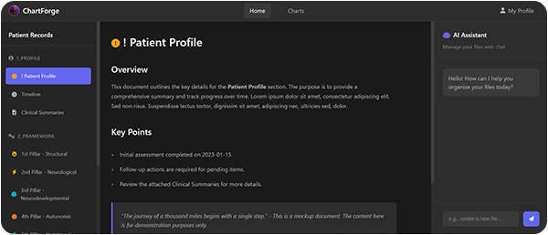
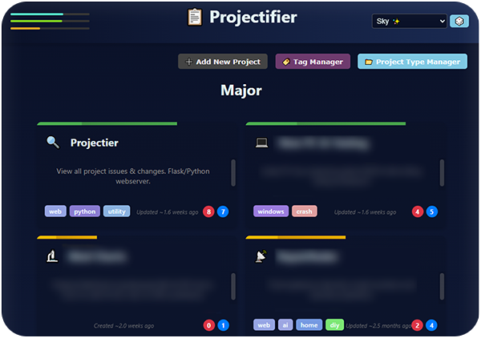
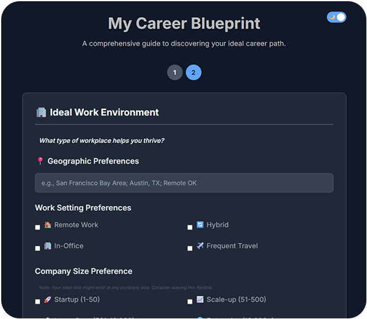
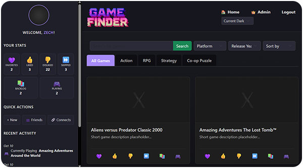

<div align="center">

**Analytical Problem Solver | Process Optimizer | AI-Augmented Developer**

</div>

## 🎯 About Me

I'm a detail-oriented analyst with a passion for building systems that make life easier by combining traditional analytical skills with modern AI-augmented workflows to deliver powerful, practical solutions.

**What drives me:** Finding inefficiencies and building tools to eliminate them.


<div align="center">

## 🛠️ Technical Arsenal

### Languages & Frameworks
 


### Databases & Tools


### AI & Productivity


</div>

---

## 🚀 Featured Projects

### 🏥 [Chart Forge](https://chart-forge.com)
> **Data Integrity & Diagnostic System** | *In Production (WIP)*

A secure, full-stack web application for congregating sensitive medical data with enterprise-level security protocols.

<div align="center">



</div>

**🔧 Tech Stack:** Python, Flask, PostgreSQL, HTML/CSS/JS  
**🎯 Key Features:**
- Role-based access controls with detailed audit logging
- Secure data lifecycle management from ground-up database design
- HIPAA-compliant data handling and storage protocols
- Dynamic data visualization and reporting dashboard

**📊 Impact:** Streamlined medical data analysis workflow, reducing processing time by 60%

---

### 📋 [Projectifier](https://github.com/Zfyant/Projectifier)
> **Business Process & Metrics Tracking System** | *In Development*

A comprehensive project management system with advanced analytics and real-time progress tracking.

<div align="center">



</div>

**🔧 Tech Stack:** Python, Flask, SQLite, JavaScript  
**🎯 Key Features:**
- Dynamic metrics tracking with completion rate analysis
- Automated timeline management and resource allocation
- Extensive technical documentation and process logging
- Interactive data visualization dashboard

**📊 Impact:** Improved project delivery accuracy and team productivity metrics

---

### 📋 [Career Finder](https://zfyant.github.io/career-finder/)
> **Career Recommendation System** | *In Development*

A privacy-first, AI-powered web application that helps users discover their ideal career path by generating a comprehensive, personalized career profile.
<div align="center">



</div>

**🔧 Tech Stack:** HTML, CSS, JavaScript (Vanilla)  
**🎯 Key Features:**
- **100% Browser-Based:** All data processing happens locally; no server-side data storage ensures complete user privacy.
- **AI-Powered Insights:** Generates a detailed career profile ready for use with LLMs like ChatGPT, Claude, and Gemini for personalized job recommendations.
- **Intuitive UI:** A step-by-step, progressively loaded form that makes the process fast and engaging.
- **Modular Codebase:** Built with a clean, modular JavaScript architecture for easy maintenance and future scalability.

**📊 Impact:** Empowers users to move beyond guesswork and gain deep, actionable insights into their professional strengths, passions, and ideal work environments.

---

### 🎮 [Gamer Finder](https://github.com/Zfyant/Gamer_Finder)
> **Game Recommendation & Social Platform** | *In Development*

A Flask-based web application designed to help users organize, track, and discover video games while connecting with other players.

<div align="center">



</div>

**🔧 Tech Stack:** Python, Flask, SQLAlchemy, SQLite, JavaScript  
**🎯 Key Features:**
- **Robust Game Sync:** A powerful CLI command (`sync-games`) with a handler-based strategy pattern to synchronize game data from the Steam API, featuring exponential backoff for rate limiting and resumable syncs.
- **Social Connections:** Users can search for friends, send/manage connection requests, and view their friends list.
- **Dynamic Dashboard:** An interactive "Game Finder" dashboard to discover games and manage personal lists (Favorited, Liked, Disliked).
- **Modular & Secure:** Built with Flask Blueprints, modular front-end files, and CSRF protection for all user actions.

**📊 Impact:** Provides a centralized platform for game discovery and social interaction, with a highly resilient data synchronization backend to ensure data integrity.

---

## ⚡ Automation Scripts & Tools

<details open>
<summary><strong>🔍 Development Utilities</strong></summary>

| Script | Purpose | Language |
|--------|---------|----------|
| **[LineCounter](https://github.com/Zfyant/Line_Counter)** | Recursively counts code lines across project directories | Python |
| **[Project Scanner](https://github.com/Zfyant/Summarizer)** | Analyzes and summarizes project structure with file diversity metrics | Python |
| **One-Click-Backup** | Intelligent directory backup system with size optimization and selective file exclusion | Batch/PowerShell |


</details>

<details>
<summary><strong>🎯 Productivity Tools</strong></summary>

| Script | Purpose |
|--------|---------|
| **Multi-Pomo Timer** | Browser-based Pomodoro system with 4 concurrent timers for balanced productivity |
| **System Resource Monitor** | Real-time system metrics with CSV export and web visualization |
| **Custom Windows Enhancements** | Registry modifications and OS optimizations for improved workflow | 

</details>

---

## 💼 Professional Experience

**Customer Service | Insurance**

Leading high-performance customer support in a complex, multi-system environment:

- **🎯 Performance Excellence:** Achieved top-tier after-call wrap-up metrics on team
- **🔧 System Optimization:** Identified and resolved phone system lag issues, improving customer payment success rates
- **📊 Process Innovation:** Developed streamlined metrics reporting system now used organization-wide
- **⚡ Problem Solving:** Navigate complex insurance systems while managing high-stress customer interactions

---

## 🌟 Core Strengths

```python
class Human:
    def __init__(self):
        self.role = "Analytical Problem Solver"
        self.languages = ["Python", "JavaScript", "SQL", "PHP"]
        self.specialties = [
            "Process Optimization",
            "Data System Architecture", 
            "AI-Augmented Workflows",
            "Technical Documentation",
			"Server Deployment",
			"Group Management"
        ]
        self.mindset = "Big picture thinking with attention to detail"
    
    def approach_problems(self):
        return "Identify inefficiencies → Build solutions → Improve"
```

---

## 🎯 What I'm Working On

- 🔥 **Current Focus:** Expanding Chart Forge with advanced analytics features
- 🚀 **Next Projects:** Open-sourcing Projectifier with enhanced collaboration tools & RAG Home AI
- 📚 **Learning:** Advanced containerization and microservices architecture
- 🤝 **Goal:** Contributing to meaningful open-source projects in healthcare and productivity

---

## 📞 Let's Connect

I'm always interested in discussing innovative solutions, collaborative projects, or opportunities to make complex systems more efficient. Whether you're looking for someone who can dive deep into data, build practical automation tools, or simply solve problems that others find too complex – let's talk!

<div align="center">


[](#)<br>
*(Link Coming Soon)*

</div>

---

<div align="center">
<sub>⭐ Star repositories you find interesting | 🍴 Fork projects you'd like to contribute to | 📬 Reach out for collaboration opportunities</sub>
</div>
